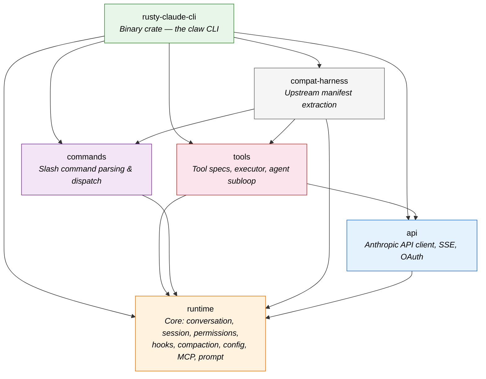
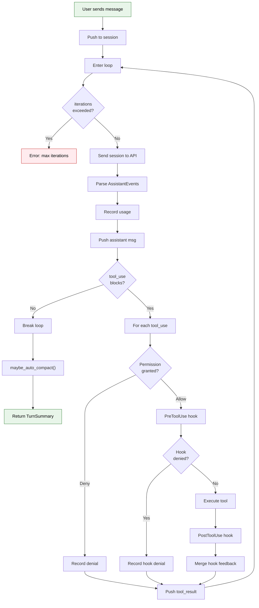
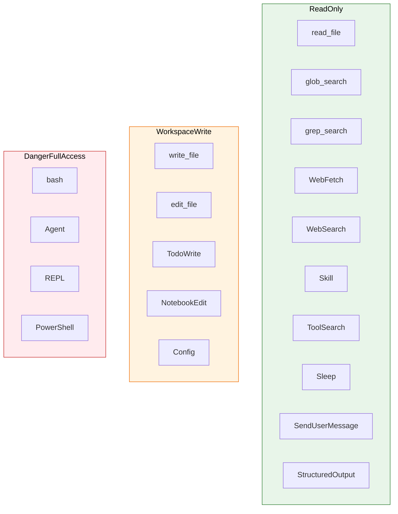
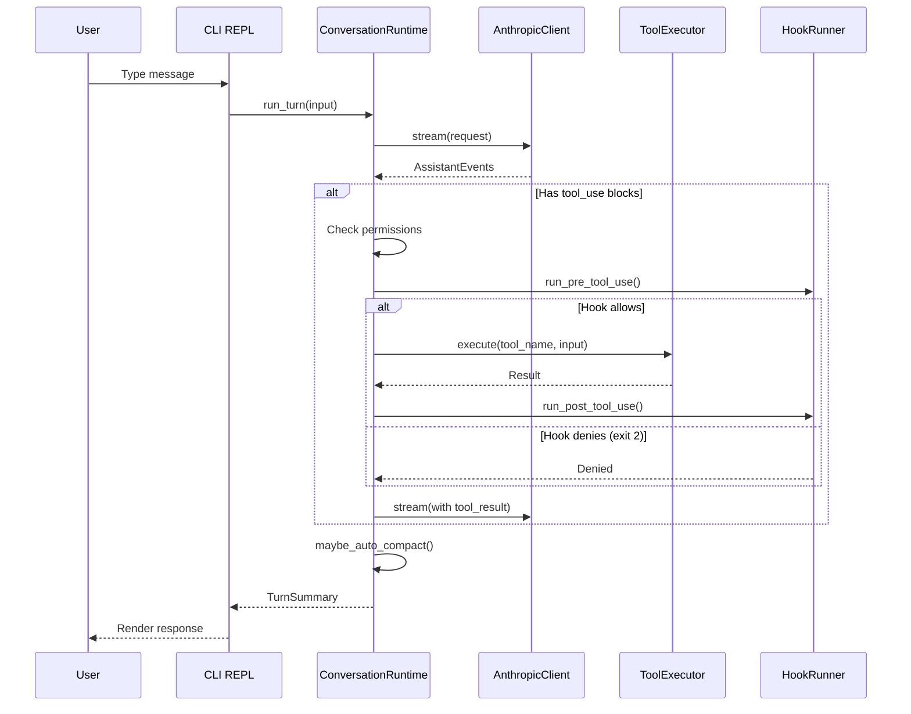
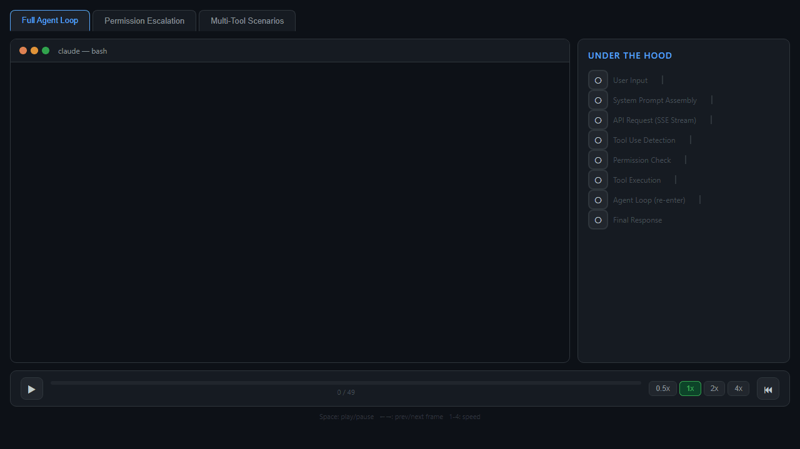

<div align="center">

# 🦀 Claw Code — Architecture Docs

**A deep dive into [claw-code](https://github.com/instructkr/claw-code), a clean-room Rust rewrite of Claude Code's agent harness**

*Dissected, diagrammed, and explained*

[](https://vitepress.dev)
[](https://github.com/instructkr/claw-code)

</div>

---

## What is this?

An interactive documentation site that reverse-engineers the architecture of **claw-code** — a working CLI agent built in Rust that can converse with the Anthropic API, execute tools, manage sessions, and enforce permissions.

The docs cover **6 Rust crates**, **19 built-in tools**, **3 escalation + 2 behavioral permission modes**, **22 slash commands**, and every major subsystem — all with Mermaid diagrams verified against the source code.

---

## Architecture at a Glance

### Crate Dependency Graph

Six crates, one foundation. Everything depends on `runtime`.



### The Agentic Loop

The heart of the system — `ConversationRuntime::run_turn()` orchestrates user → API → tool → result cycles:



### 19 Tools Across 3 Permission Tiers

Every tool is gated by a permission level — from read-only file access to full shell execution:



### Data Flow

From user input to rendered response — the full request lifecycle:



---

## What's Inside

| Page | What You'll Learn |
|:-----|:------------------|
| [Architecture Overview](architecture.md) | Crate map, module index, data flow |
| [The Agentic Loop](agentic-loop.md) | `ConversationRuntime`, `run_turn()`, event types |
| [Tool System](tools.md) | 19 tools, `ToolExecutor` trait, agent sub-loops |
| [Permission Model](permissions.md) | 3 escalation + 2 behavioral modes, authorization logic |
| [Hook System](hooks.md) | PreToolUse/PostToolUse lifecycle, exit codes |
| [Session & Compaction](sessions.md) | Persistence, auto-compaction, token estimation |
| [API Client](api-client.md) | OAuth PKCE, SSE streaming, retry strategy |
| [System Prompt](system-prompt.md) | Prompt assembly, CLAUDE.md discovery |
| [MCP Integration](mcp.md) | Server transports, tool namespacing, FNV-1a |
| [CLI & Commands](cli.md) | 22 slash commands, REPL loop |
| [Trivia](trivia.md) | Fun facts and Easter eggs from the source |

---

## Fun Facts

- **♾️ Infinite by default** — `max_iterations` is `usize::MAX` (18.4 quintillion). The agent could loop for 584 billion years.
- **🚫 Zero `unsafe`** — The entire workspace has `unsafe_code = "forbid"`. Pure safe Rust.
- **🔧 No dependencies for basics** — Hand-rolled SSE parser, JSON parser, base64url encoder, percent encoder. No serde for sessions.
- **📏 Token estimation** — `text.len() / 4 + 1`. No tokenizer needed.
- **🔑 Exit code 2 = Deny** — Hooks use Unix convention: 0 = allow, 2 = deny, anything else = warn but continue.

---

## Interactive Terminal Replay

An interactive sandbox that simulates real Claude Code sessions while highlighting the architecture under the hood:

<div align="center">

</div>

Three scenarios with verified source paths:
- **Full Agent Loop** — input → prompt → API → `read_file` → `edit_file` → `bash` (permission escalation) → `end_turn`
- **Permission Escalation** — `WorkspaceWrite` < `DangerFullAccess` → `PermissionPrompter::decide()` → `PreToolUse` hook → `execute_bash()`
- **Multi-Tool** — hook denial (exit 2), auto-compaction (`compact.rs`, local summarization), `Agent` tool sub-task

Open [`sandbox/index.html`](sandbox/index.html) in any browser to try it — no build step needed.

---

## Local Development

```bash
npm install
npx vitepress dev     # http://localhost:5173
npx vitepress build   # Static output → .vitepress/dist/
```

---

<div align="center">
<sub>Built by studying the <a href="https://github.com/instructkr/claw-code">instructkr/claw-code</a> source code</sub>
</div>
