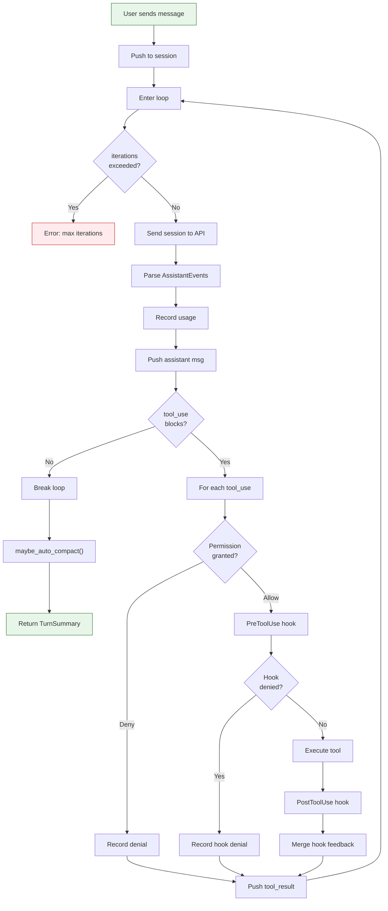

# The Agentic Loop

The **agentic loop** is the heart of claw-code. It lives in `ConversationRuntime` (`runtime/src/conversation.rs`) and implements the classic agent pattern: send a message to the LLM, check if it wants to use tools, execute them, feed results back, repeat.

## The Runtime Struct

```rust
pub struct ConversationRuntime<C, T> {
    session: Session,              // Conversation history
    api_client: C,                 // Anthropic API (trait)
    tool_executor: T,              // Tool runner (trait)
    permission_policy: PermissionPolicy,
    system_prompt: Vec<String>,
    max_iterations: usize,         // Default: usize::MAX!
    usage_tracker: UsageTracker,
    hook_runner: HookRunner,
    auto_compaction_input_tokens_threshold: u32,
}
```

::: warning Trivia: Infinite Loop by Default
The default `max_iterations` is `usize::MAX` — that's **18,446,744,073,709,551,615** iterations. The agent can theoretically loop for longer than the age of the universe. In practice, it stops when the assistant produces no `tool_use` blocks.
:::

The runtime is generic over two traits:

- **`ApiClient`** — sends requests and returns a `Vec<AssistantEvent>`
- **`ToolExecutor`** — executes a named tool with JSON input

This makes the entire system testable with mock implementations.

## The `run_turn` Method

This is the core method. Here's what happens when you type a message:



## Step-by-Step Walkthrough

### 1. Accept User Input

The user's message is wrapped as a `ConversationMessage::user_text()` and pushed onto the session's message list.

### 2. API Call

The entire session (system prompt + all messages) is sent to the API client:

```rust
let request = ApiRequest {
    system_prompt: self.system_prompt.clone(),
    messages: self.session.messages.clone(),
};
let events = self.api_client.stream(request)?;
```

### 3. Parse Assistant Response

The streamed `AssistantEvent`s are assembled into a `ConversationMessage`:

- `TextDelta(s)` — accumulated into text blocks
- `ToolUse { id, name, input }` — stored as tool_use blocks
- `Usage(tokens)` — recorded for tracking
- `MessageStop` — marks completion

### 4. Tool Execution Loop

For each `tool_use` block in the assistant's response:

1. **Permission check** — `PermissionPolicy::authorize()` decides allow/deny
2. **PreToolUse hook** — Shell commands run before the tool; exit code 2 = deny
3. **Tool execution** — `ToolExecutor::execute()` runs the actual tool
4. **PostToolUse hook** — Shell commands run after; can deny or append feedback
5. **Result recording** — A `tool_result` message is pushed to the session

### 5. Auto-Compaction Check

After the loop ends, `maybe_auto_compact()` checks if cumulative input tokens exceed the threshold (default: 200,000). If so, older messages are compacted into a summary.

### 6. Return Summary

The turn returns a `TurnSummary` containing:

```rust
pub struct TurnSummary {
    pub assistant_messages: Vec<ConversationMessage>,
    pub tool_results: Vec<ConversationMessage>,
    pub iterations: usize,
    pub usage: TokenUsage,
    pub auto_compaction: Option<AutoCompactionEvent>,
}
```

## Event Types

The API client produces these events:

```rust
pub enum AssistantEvent {
    TextDelta(String),         // Streamed text chunk
    ToolUse {                  // Tool invocation
        id: String,
        name: String,
        input: String,
    },
    Usage(TokenUsage),         // Token counts
    MessageStop,               // Stream complete
}
```

## The `StaticToolExecutor`

For testing and simple setups, the runtime provides a `StaticToolExecutor` that registers handlers as closures:

```rust
let executor = StaticToolExecutor::new()
    .register("add", |input| {
        let total: i32 = input.split(',')
            .map(|p| p.parse::<i32>().unwrap())
            .sum();
        Ok(total.to_string())
    });
```

This is used extensively in tests to verify the loop without real tool implementations.

::: tip Design Pattern
The generic trait approach means you can swap the API client for a mock, the tool executor for a test harness, or the permission prompter for an auto-approver — all without changing the loop logic.
:::

## Auto-Compaction Threshold

The threshold can be configured via:

1. **Builder method**: `.with_auto_compaction_input_tokens_threshold(100_000)`
2. **Environment variable**: `CLAUDE_CODE_AUTO_COMPACT_INPUT_TOKENS`
3. **Default**: 200,000 tokens
