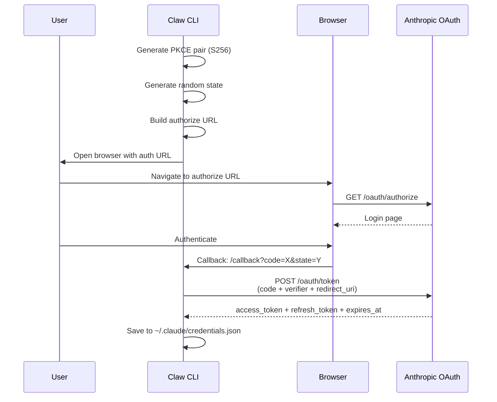
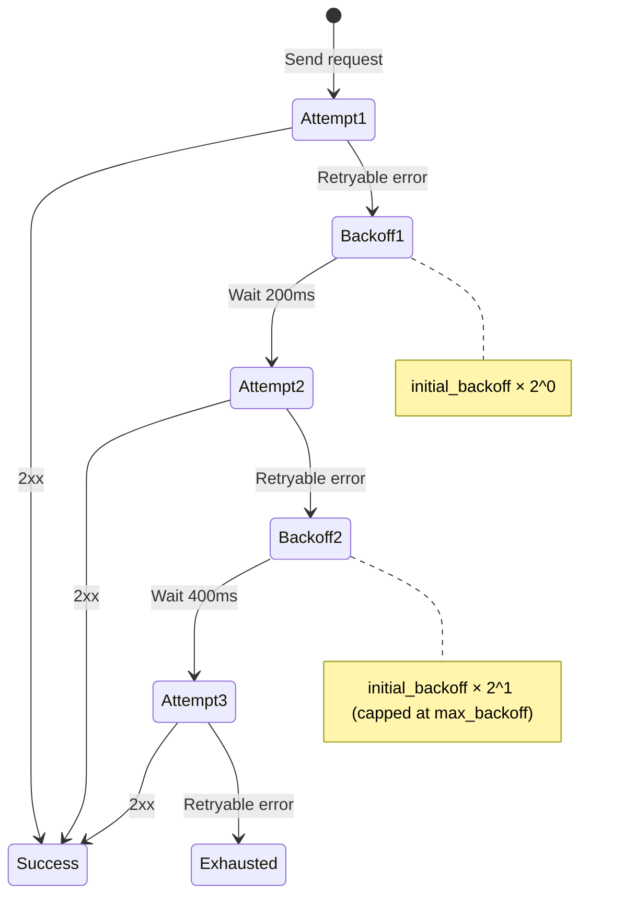

# API Client

The `api` crate provides the Anthropic API client with SSE streaming, OAuth authentication, and retry with exponential backoff.

## Client Architecture

```rust
pub struct AnthropicClient {
    http: reqwest::Client,
    auth: AuthSource,
    base_url: String,            // Default: https://api.anthropic.com
    max_retries: u32,            // Default: 2
    initial_backoff: Duration,   // Default: 200ms
    max_backoff: Duration,       // Default: 2s
}
```

## Authentication

The client supports multiple auth sources:

```rust
pub enum AuthSource {
    None,
    ApiKey(String),                              // x-api-key header
    BearerToken(String),                         // Authorization: Bearer
    ApiKeyAndBearer { api_key, bearer_token },   // Both headers
}
```

Auth resolution priority:

1. `ANTHROPIC_API_KEY` env var → `ApiKey`
2. `ANTHROPIC_AUTH_TOKEN` env var → `BearerToken`
3. Both set → `ApiKeyAndBearer`
4. Neither → check saved OAuth credentials

## OAuth Flow



### PKCE Details

The OAuth flow uses **PKCE (Proof Key for Code Exchange)** with SHA-256:

```rust
pub fn generate_pkce_pair() -> PkceCodePair {
    let verifier = generate_random_token(32);  // 32 random bytes, base64url
    PkceCodePair {
        challenge: code_challenge_s256(&verifier),  // SHA-256 + base64url
        verifier,
        challenge_method: PkceChallengeMethod::S256,
    }
}
```

::: info Trivia: Hand-Rolled Base64URL
The OAuth module implements its own `base64url_encode()` function — a lookup table based encoder that produces URL-safe base64 without padding. No external crate needed!
:::

### Token Refresh

OAuth tokens are refreshed **lazily** at startup:

```rust
pub fn resolve_startup_auth_source(load_oauth_config) -> AuthSource {
    // 1. Check env vars first
    // 2. Check saved OAuth token
    // 3. If expired and has refresh_token → refresh it
    // 4. Save refreshed token back to disk
}
```

The refresh preserves the original `refresh_token` if the server doesn't return a new one.

## Retry Strategy



### Retryable HTTP Status Codes

```rust
const fn is_retryable_status(status: StatusCode) -> bool {
    matches!(status.as_u16(), 408 | 409 | 429 | 500 | 502 | 503 | 504)
}
```

| Status | Meaning |
|:-:|:--|
| 408 | Request Timeout |
| 409 | Conflict |
| 429 | Too Many Requests (rate limited) |
| 500 | Internal Server Error |
| 502 | Bad Gateway |
| 503 | Service Unavailable |
| 504 | Gateway Timeout |

### Backoff Calculation

```rust
fn backoff_for_attempt(&self, attempt: u32) -> Duration {
    let multiplier = 1_u32.checked_shl(attempt - 1);  // 2^(attempt-1)
    self.initial_backoff
        .checked_mul(multiplier)
        .map_or(self.max_backoff, |delay| delay.min(self.max_backoff))
}
```

With defaults (200ms initial, 2s max):
- Attempt 1: 200ms
- Attempt 2: 400ms
- Attempt 3: 800ms (would be, but max_retries=2 means only 3 attempts)

## SSE Streaming

The SSE parser (`sse.rs`) is **hand-rolled** — it processes raw bytes chunk by chunk:

```rust
pub struct SseParser {
    buffer: Vec<u8>,
}

impl SseParser {
    pub fn push(&mut self, chunk: &[u8]) -> Vec<StreamEvent> {
        self.buffer.extend_from_slice(chunk);
        // Find frame boundaries (\n\n or \r\n\r\n)
        // Parse each frame into StreamEvent
    }
}
```

### Frame Parsing

Each SSE frame is parsed by looking for:
- `event:` lines → event name
- `data:` lines → payload (joined with newlines)
- `:` lines → comments (ignored)
- `event: ping` → ignored
- `data: [DONE]` → ignored

::: tip Trivia: Hand-Rolled SSE Parser
Instead of using an SSE library, claw-code implements its own `SseParser`. It handles chunked delivery (where a frame might be split across multiple TCP packets), both `\n\n` and `\r\n\r\n` frame separators, multi-line data fields, and the `[DONE]` sentinel. All in about 100 lines of Rust.
:::

## MessageStream

The streaming API wraps the SSE parser in a `MessageStream` that yields `StreamEvent`s one at a time:

```rust
pub struct MessageStream {
    request_id: Option<String>,
    response: reqwest::Response,
    parser: SseParser,
    pending: VecDeque<StreamEvent>,
    done: bool,
}
```

The `next_event()` method buffers parsed events and fetches more chunks as needed, providing a clean async iterator-like interface.
