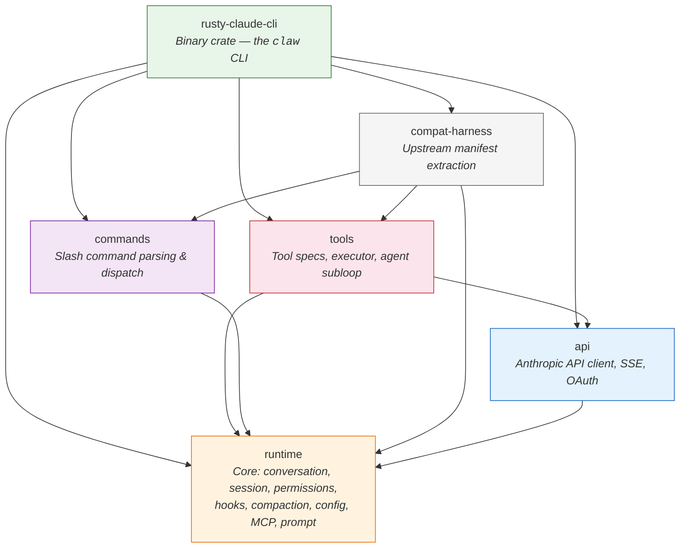
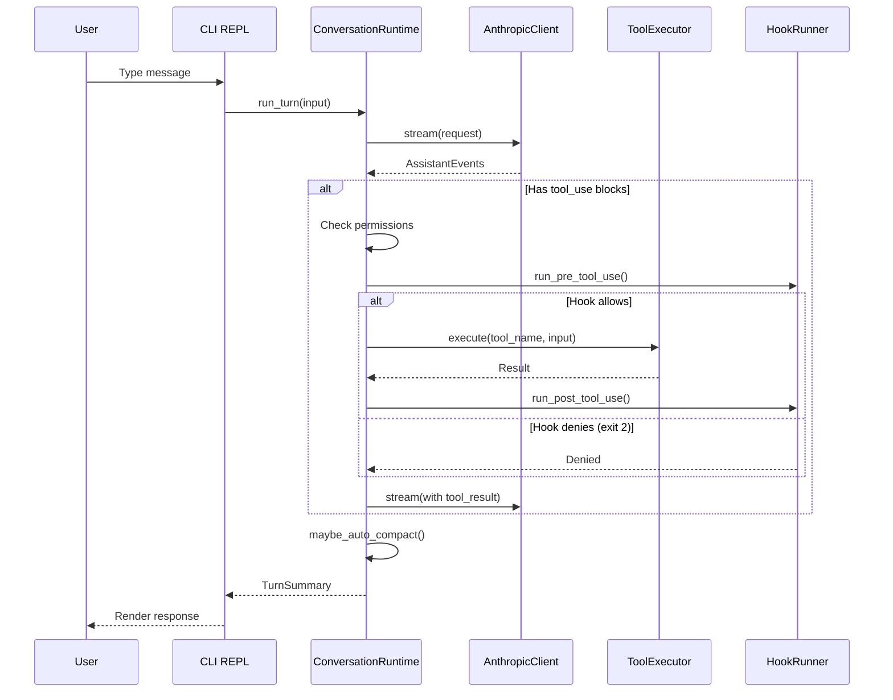

# Architecture Overview

The **claw-code** project is a clean-room reimplementation of Claude Code's agent harness in **Rust**, with a companion **Python** metadata workspace. It provides a working CLI agent (`claw`) that can converse with the Anthropic API, execute tools, manage sessions, and enforce permissions — all without depending on the original TypeScript codebase.

## Two Implementations

The repository contains two distinct implementations:

| Implementation | Language | Purpose |
|:--|:--|:--|
| `rust/crates/` | Rust | A **working CLI agent** with agentic loop, tools, permissions, hooks, sessions, MCP |
| `src/` | Python | A **parity tracker** that audits porting progress against JSON snapshots of the original TS surface |

The Rust side is the real product — this documentation focuses on it.

## Crate Dependency Graph

::: info Key Insight
The `runtime` crate is the foundation — every other crate depends on it. It contains the conversation loop, permission system, hook runner, session persistence, compaction, config loading, MCP utilities, OAuth, prompt building, and more.
:::

## Module Map

Here's a quick reference of what lives where:

### `runtime` (the foundation)

| Module | Responsibility |
|:--|:--|
| `conversation.rs` | `ConversationRuntime` — the agentic loop |
| `permissions.rs` | 5 permission modes + `PermissionPrompter` trait |
| `hooks.rs` | PreToolUse / PostToolUse shell hooks |
| `session.rs` | Session persistence with custom JSON parser |
| `compact.rs` | Auto-compaction algorithm |
| `prompt.rs` | System prompt builder, CLAUDE.md discovery |
| `config.rs` | Runtime config loader (settings.json, hooks, MCP) |
| `mcp.rs` | MCP tool naming, server signatures, CCR proxy |
| `oauth.rs` | PKCE OAuth flow, credential storage |
| `bash.rs` | Bash command execution |
| `file_ops.rs` | Read/write/edit/glob/grep file operations |
| `json.rs` | Custom JSON parser (no serde for sessions) |
| `sandbox.rs` | Sandbox environment support |
| `usage.rs` | Token usage tracking |
| `bootstrap.rs` | Bootstrap/initialization utilities |
| `remote.rs` | Remote session support |
| `mcp_client.rs` | MCP client transports (Stdio, SSE, HTTP, WS, SDK) |
| `mcp_stdio.rs` | MCP stdio process spawning, JSON-RPC, server manager |
| `sse.rs` | Incremental SSE parser (separate from `api` crate's parser) |

### `api` (Anthropic API client)

| Module | Responsibility |
|:--|:--|
| `client.rs` | `AnthropicClient` — auth, retry, streaming |
| `sse.rs` | Hand-rolled SSE parser |
| `types.rs` | Request/response types (Messages API) |
| `error.rs` | API error types with retryability |

### `tools` (tool definitions)

| Module | Responsibility |
|:--|:--|
| `lib.rs` | All tool specs, `execute_tool()` dispatcher, agent subloop |

### `commands` (slash commands)

| Module | Responsibility |
|:--|:--|
| `lib.rs` | 22 slash command definitions, parser, help renderer |

## Data Flow

## Next Steps

Dive deeper into each subsystem:

- **[The Agentic Loop](./agentic-loop)** — How `ConversationRuntime` orchestrates the conversation
- **[Tool System](./tools)** — How tools are defined, registered, and executed
- **[Permission Model](./permissions)** — The 5 modes and escalation logic
- **[Hook System](./hooks)** — Shell-based lifecycle hooks
- **[Session & Compaction](./sessions)** — Persistence and context management
- **[API Client](./api-client)** — SSE streaming and retry strategy
