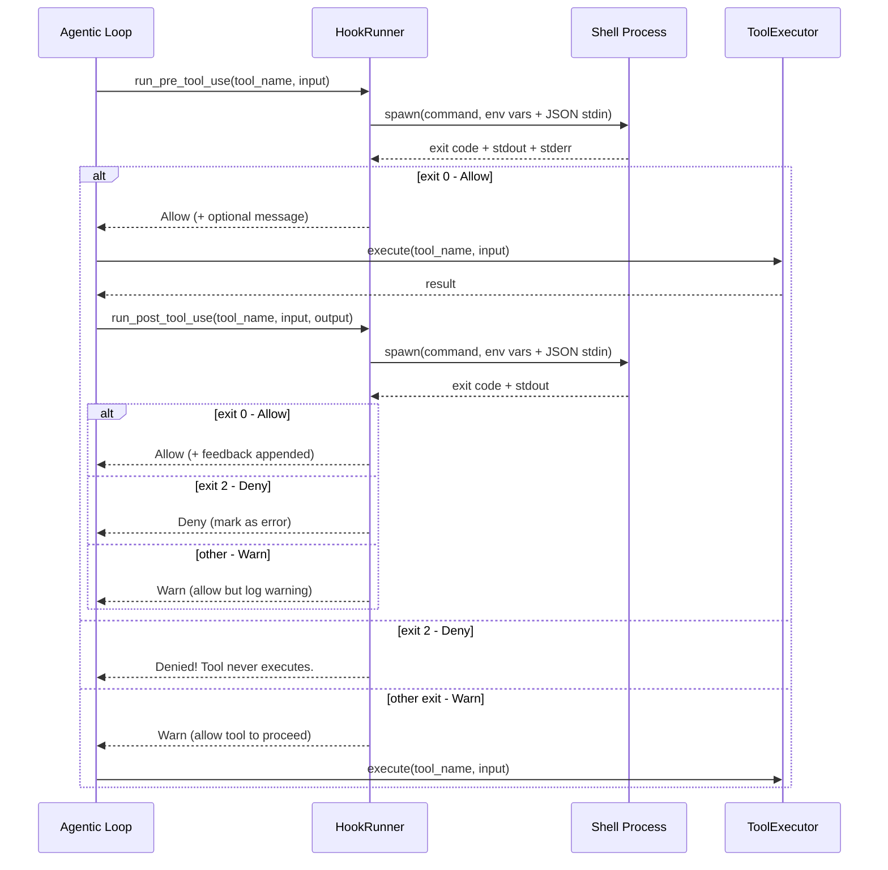

# Hook System

Hooks allow external shell commands to **intercept tool execution** at two points: before a tool runs (PreToolUse) and after it completes (PostToolUse). They're configured in `settings.json` and executed by the `HookRunner`.

## Hook Lifecycle



## Exit Code Semantics

| Exit Code | Meaning | Effect |
|:-:|:--|:--|
| **0** | Allow | Tool proceeds; stdout captured as feedback |
| **2** | Deny | Tool is **blocked**; stdout becomes the denial message |
| **Any other** | Warn | Tool proceeds; a warning is logged but execution continues |
| **None** (signal) | Warn | Hook was killed by a signal; treated as a warning |

::: warning Unix Convention
Exit code 2 for denial follows a Unix convention — it's the standard code for "misuse of shell builtins" and was chosen to be distinct from general errors (1). This means a hook that crashes with exit code 1 will only produce a warning, not block the tool.
:::

## Environment Variables

Each hook process receives these environment variables:

| Variable | Description | Example |
|:--|:--|:--|
| `HOOK_EVENT` | Event type | `PreToolUse` or `PostToolUse` |
| `HOOK_TOOL_NAME` | Tool being invoked | `bash` |
| `HOOK_TOOL_INPUT` | Raw tool input JSON | `{"command":"ls"}` |
| `HOOK_TOOL_IS_ERROR` | Whether tool errored | `0` or `1` |
| `HOOK_TOOL_OUTPUT` | Tool output (PostToolUse only) | `file1.txt\nfile2.txt` |

Additionally, a full JSON payload is piped to **stdin**:

```json
{
  "hook_event_name": "PreToolUse",
  "tool_name": "bash",
  "tool_input": { "command": "ls" },
  "tool_input_json": "{\"command\":\"ls\"}",
  "tool_output": null,
  "tool_result_is_error": false
}
```

::: tip Dual Input Formats
The hook receives tool input in **three ways**: as `HOOK_TOOL_INPUT` env var, as parsed `tool_input` in the JSON stdin, and as raw `tool_input_json` in the JSON stdin. This gives hook authors flexibility in how they parse it.
:::

## Hook Configuration

Hooks are configured in the `RuntimeHookConfig`:

```rust
pub struct RuntimeHookConfig {
    pre_tool_use: Vec<String>,   // Shell commands
    post_tool_use: Vec<String>,  // Shell commands
}
```

Each command string is executed via the system shell:
- **Unix**: `sh -lc "command"`
- **Windows**: `cmd /C "command"`

Multiple hooks can be registered for the same event. They run sequentially — if any PreToolUse hook returns exit code 2, subsequent hooks are skipped and the tool is denied.

## Feedback Merging

Hook stdout is captured and merged into the tool result:

1. **PreToolUse** feedback is prepended to the tool output
2. **PostToolUse** feedback is appended
3. If both hooks provide feedback, the output becomes:

```
[tool output]

Hook feedback:
[pre hook message]

Hook feedback:
[post hook message]
```

If a PostToolUse hook denies (exit 2), the feedback is labeled `Hook feedback (denied):` and the result is marked as an error.

## Example: Blocking Dangerous Commands

```bash
# .claude/settings.json
{
  "hooks": {
    "PreToolUse": [
      "if echo \"$HOOK_TOOL_INPUT\" | grep -q 'rm -rf'; then echo 'Blocked: destructive command'; exit 2; fi"
    ]
  }
}
```

This hook checks if a bash command contains `rm -rf` and blocks it with exit code 2.
