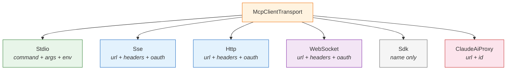

# MCP Integration

The **Model Context Protocol (MCP)** integration allows claw-code to connect to external tool servers. The `runtime` crate provides utilities for tool naming, server identification, and config management.

## MCP Tool Naming

MCP tools are namespaced to prevent collisions between different servers:

```
mcp__{server_name}__{tool_name}
```

For example, a tool called `weather` from a server called `github.com` becomes:

```
mcp__github_com__weather
```

### Name Normalization

Server and tool names are normalized by replacing non-alphanumeric characters (except `_` and `-`) with underscores:

```rust
pub fn normalize_name_for_mcp(name: &str) -> String {
    name.chars().map(|ch| match ch {
        'a'..='z' | 'A'..='Z' | '0'..='9' | '_' | '-' => ch,
        _ => '_',
    }).collect()
}
```

For `claude.ai` prefixed servers, consecutive underscores are collapsed and leading/trailing underscores are trimmed:

```
"claude.ai Example   Server!!" → "claude_ai_Example_Server"
```

## Server Types

The MCP config supports multiple server transports:



## Server Signatures

Each server has a **signature** used for deduplication and identity:

```rust
pub fn mcp_server_signature(config: &McpServerConfig) -> Option<String> {
    match config {
        Stdio(c)  => Some(format!("stdio:[{}]", command_signature)),
        Sse(c)    => Some(format!("url:{}", unwrap_ccr_proxy(c.url))),
        Http(c)   => Some(format!("url:{}", unwrap_ccr_proxy(c.url))),
        Ws(c)     => Some(format!("url:{}", unwrap_ccr_proxy(c.url))),
        ClaudeAiProxy(c) => Some(format!("url:{}", unwrap_ccr_proxy(c.url))),
        Sdk(_)    => None,  // SDK servers have no external identity
    }
}
```

## CCR Proxy Unwrapping

Claude's CCR (Cloud Code Runner) proxy URLs wrap the actual MCP server URL as a query parameter. The `unwrap_ccr_proxy_url()` function extracts the real URL:

```
Input:  https://api.anthropic.com/v2/session_ingress/shttp/mcp/123?mcp_url=https%3A%2F%2Fvendor.example%2Fmcp
Output: https://vendor.example/mcp
```

This ensures that two servers pointing to the same underlying MCP endpoint (one direct, one via proxy) get the same signature.

## Config Hashing

Server configs are hashed for change detection using FNV-1a:

```rust
fn stable_hex_hash(value: &str) -> String {
    let mut hash = 0xcbf2_9ce4_8422_2325_u64;  // FNV offset basis
    for byte in value.as_bytes() {
        hash ^= u64::from(*byte);
        hash = hash.wrapping_mul(0x0100_0000_01b3);  // FNV prime
    }
    format!("{hash:016x}")
}
```

The hash includes transport type, URL, headers, helpers, and OAuth config — but **not the scope** (user vs. local). This means the same server configured at both user and project level gets the same hash.

## Scoped Configuration

MCP servers are scoped to configuration sources:

```rust
pub struct ScopedMcpServerConfig {
    pub scope: ConfigSource,      // User, Local, etc.
    pub config: McpServerConfig,
}
```

The scope tracks where the config came from but doesn't affect the server's identity or behavior.
