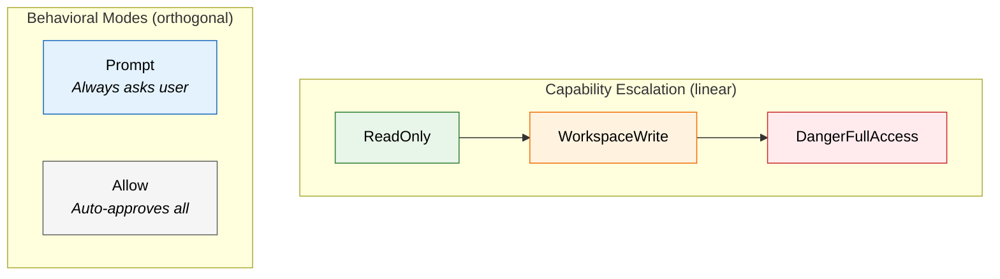
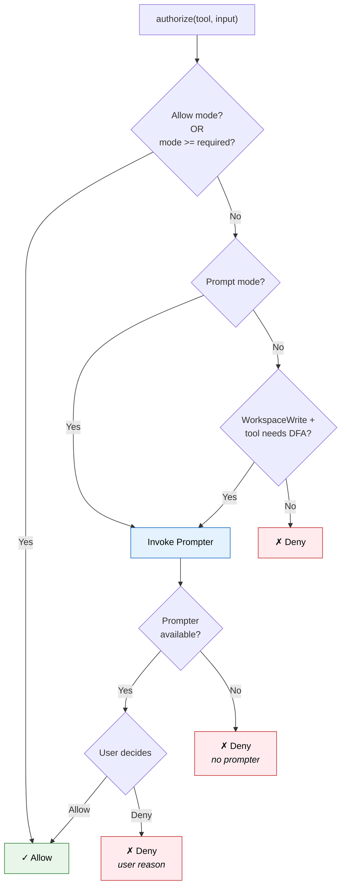

# Permission Model

The permission system controls which tools the agent can use. It has **5 escalating modes** and a pluggable **prompter trait** that allows interactive approval during execution.

## The 5 Permission Modes

```rust
pub enum PermissionMode {
    ReadOnly,           // Can only read files, search, fetch
    WorkspaceWrite,     // Can also write/edit files
    DangerFullAccess,   // Can run bash, REPL, PowerShell
    Prompt,             // Always asks the user
    Allow,              // Allows everything without asking
}
```

The modes form an escalation hierarchy:



## Authorization Decision Tree

When a tool is invoked, `PermissionPolicy::authorize()` follows this logic:



## The PermissionPrompter Trait

```rust
pub trait PermissionPrompter {
    fn decide(&mut self, request: &PermissionRequest) -> PermissionPromptDecision;
}

pub struct PermissionRequest {
    pub tool_name: String,
    pub input: String,
    pub current_mode: PermissionMode,
    pub required_mode: PermissionMode,
}

pub enum PermissionPromptDecision {
    Allow,
    Deny { reason: String },
}
```

The prompter is passed as `Option<&mut dyn PermissionPrompter>`. When the user runs the CLI interactively, the REPL provides a prompter that renders a TUI confirmation dialog. In tests, mock prompters are used.

## Per-Tool Requirements

The `PermissionPolicy` stores per-tool permission requirements:

```rust
let policy = PermissionPolicy::new(PermissionMode::WorkspaceWrite)
    .with_tool_requirement("read_file", PermissionMode::ReadOnly)
    .with_tool_requirement("bash", PermissionMode::DangerFullAccess);
```

If no specific requirement is registered for a tool, it defaults to `DangerFullAccess` — the most restrictive level.

::: tip Default is Restrictive
Unknown tools default to requiring `DangerFullAccess`. This means adding a new tool without registering its permission level makes it require the highest privilege. Safety by default.
:::

## Escalation Scenarios

| Active Mode | Tool Requires | Result |
|:--|:--|:--|
| Allow | Anything | Always allowed |
| DangerFullAccess | DangerFullAccess | Allowed |
| WorkspaceWrite | WorkspaceWrite | Allowed |
| WorkspaceWrite | DangerFullAccess | **Prompts user** (if prompter available) |
| ReadOnly | WorkspaceWrite | Denied outright |
| ReadOnly | DangerFullAccess | Denied outright |
| Prompt | Anything | **Always prompts user** |

::: warning Key Insight
The `WorkspaceWrite → DangerFullAccess` escalation is special. Unlike `ReadOnly`, which just denies, `WorkspaceWrite` mode can prompt for dangerous tools. This lets users run in a "mostly safe" mode while still being able to approve individual bash commands.
:::

## Denied Tool Results

When a tool is denied, the result is recorded as an error `tool_result`:

```rust
PermissionOutcome::Deny { reason } => {
    ConversationMessage::tool_result(tool_use_id, tool_name, reason, true)
}
```

The assistant sees the denial reason and can adjust its approach.
