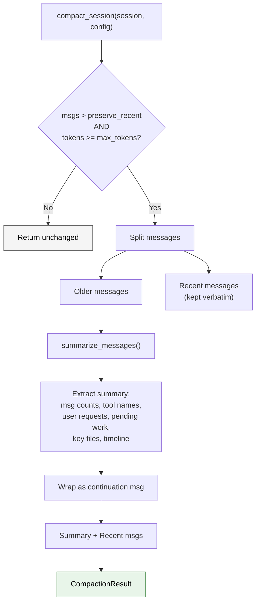

# Session & Compaction

Sessions are the persistence layer of the agent. They store the full conversation history and can be saved to disk, resumed later, and automatically compacted when context grows too large.

## Session Structure

```rust
pub struct Session {
    pub version: u32,               // Always 1
    pub messages: Vec<ConversationMessage>,
}

pub struct ConversationMessage {
    pub role: MessageRole,          // System, User, Assistant, Tool
    pub blocks: Vec<ContentBlock>,
    pub usage: Option<TokenUsage>,  // Only on assistant messages
}

pub enum ContentBlock {
    Text { text: String },
    ToolUse { id: String, name: String, input: String },
    ToolResult { tool_use_id: String, tool_name: String, output: String, is_error: bool },
}
```

## Custom JSON Parser

::: info Trivia: No Serde for Sessions
The session persistence uses a **custom JSON parser** (`json.rs`) instead of serde. The `JsonValue` type implements its own `parse()` and `render()` methods. This means the session format is independent of serde's serialization quirks and can be precisely controlled.
:::

Sessions are serialized to a JSON format like:

```json
{
  "version": 1,
  "messages": [
    {
      "role": "user",
      "blocks": [{ "type": "text", "text": "Hello" }]
    },
    {
      "role": "assistant",
      "blocks": [{ "type": "text", "text": "Hi there!" }],
      "usage": {
        "input_tokens": 10,
        "output_tokens": 4,
        "cache_creation_input_tokens": 0,
        "cache_read_input_tokens": 0
      }
    }
  ]
}
```

## Compaction Algorithm

When a conversation gets too long, the compaction system summarizes older messages while preserving recent ones.



### Compaction Config

```rust
pub struct CompactionConfig {
    pub preserve_recent_messages: usize,  // Default: 4
    pub max_estimated_tokens: usize,      // Default: 10,000
}
```

### What Gets Extracted

The summarizer analyzes the older messages and extracts:

1. **Message counts** — How many user, assistant, and tool messages were compacted
2. **Tool names** — All tools mentioned (deduplicated and sorted)
3. **Recent user requests** — Last 3 user messages (truncated to 160 chars)
4. **Pending work** — Messages containing "todo", "next", "pending", "follow up", "remaining"
5. **Key files** — Tokens containing `/` with known extensions (.rs, .ts, .js, .json, .md, etc.)
6. **Current work** — The most recent non-empty text block
7. **Full timeline** — Every message summarized as `role: content`

::: tip Trivia: Keyword-Based Pending Work Detection
The compaction system infers "pending work" by searching for keywords: `todo`, `next`, `pending`, `follow up`, `remaining`. It's a simple heuristic but surprisingly effective for preserving context about what the user was working on.
:::

### Token Estimation

Token counts are estimated without a tokenizer:

```rust
fn estimate_message_tokens(message: &ConversationMessage) -> usize {
    message.blocks.iter().map(|block| match block {
        ContentBlock::Text { text } => text.len() / 4 + 1,
        ContentBlock::ToolUse { name, input, .. } => (name.len() + input.len()) / 4 + 1,
        ContentBlock::ToolResult { tool_name, output, .. } =>
            (tool_name.len() + output.len()) / 4 + 1,
    }).sum()
}
```

::: warning Trivia: The `len() / 4 + 1` Heuristic
Instead of using a proper tokenizer (like tiktoken), claw-code estimates tokens as `text.len() / 4 + 1`. This is a common approximation — English text averages about 4 characters per token. The `+ 1` prevents zero-length messages from being estimated as zero tokens.
:::

## Auto-Compaction

Auto-compaction happens at the end of every `run_turn()`:

```rust
fn maybe_auto_compact(&mut self) -> Option<AutoCompactionEvent> {
    if self.usage_tracker.cumulative_usage().input_tokens
        < self.auto_compaction_input_tokens_threshold
    {
        return None;
    }
    // Compact with max_estimated_tokens: 0 (compact everything possible)
    let result = compact_session(&self.session, CompactionConfig {
        max_estimated_tokens: 0,
        ..CompactionConfig::default()
    });
    // ...
}
```

The threshold defaults to **200,000 input tokens** and can be overridden via the `CLAUDE_CODE_AUTO_COMPACT_INPUT_TOKENS` environment variable.

## Continuation Message Format

After compaction, the summary is wrapped in a continuation message:

> *This session is being continued from a previous conversation that ran out of context. The summary below covers the earlier portion of the conversation.*
>
> *Summary:*
> *[compacted content]*
>
> *Recent messages are preserved verbatim.*
>
> *Continue the conversation from where it left off without asking the user any further questions.*

This message becomes the first `System` message in the compacted session, followed by the preserved recent messages.

## File Candidate Detection

The compaction extracts "key files" using a simple heuristic:

```rust
fn extract_file_candidates(content: &str) -> Vec<String> {
    content.split_whitespace()
        .filter_map(|token| {
            let candidate = token.trim_matches(|c| matches!(c, ',' | '.' | ...));
            if candidate.contains('/') && has_interesting_extension(candidate) {
                Some(candidate.to_string())
            } else { None }
        })
        .collect()
}
```

It looks for whitespace-separated tokens that contain `/` and end with known extensions: `.rs`, `.ts`, `.tsx`, `.js`, `.json`, `.md`.
