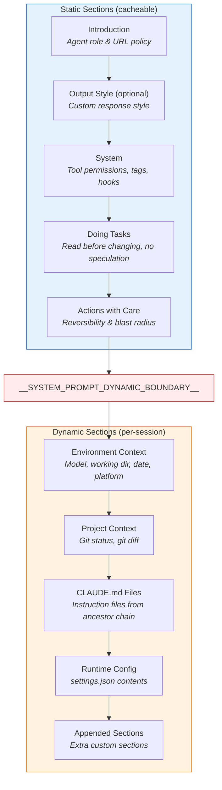
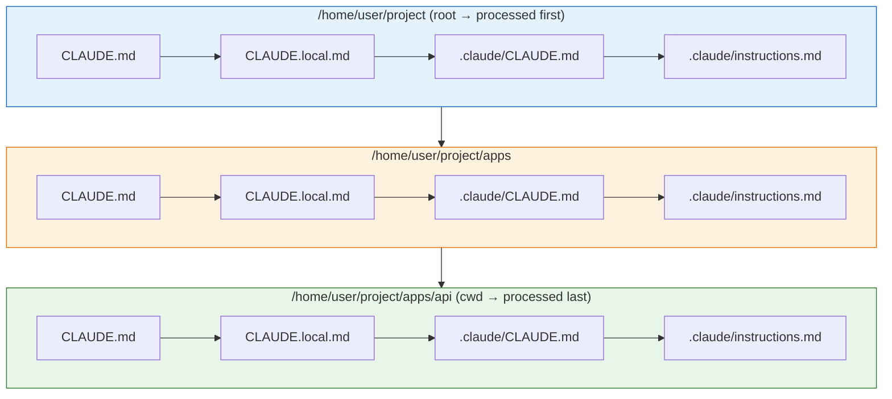

# System Prompt & CLAUDE.md

The system prompt is assembled dynamically at startup by `SystemPromptBuilder`. It combines hardcoded agent instructions with project context, discovered instruction files (CLAUDE.md), and runtime configuration.

## Prompt Structure

The system prompt is built as a `Vec<String>` of sections, joined with double newlines:



::: info The Dynamic Boundary
The `__SYSTEM_PROMPT_DYNAMIC_BOUNDARY__` marker separates static (cacheable) sections from dynamic (per-session) sections. Everything above the boundary is the same across sessions; everything below changes based on the project context.
:::

## CLAUDE.md Discovery

Instruction files are discovered by collecting directories from the working directory **up** to the filesystem root, then processing them in **root-first** order:



For **each directory** (from root down to cwd), these files are checked in order:
1. `CLAUDE.md`
2. `CLAUDE.local.md`
3. `.claude/CLAUDE.md`
4. `.claude/instructions.md`

### Deduplication

Files with identical content (after normalizing blank lines and trimming) are deduplicated using a hash:

```rust
fn dedupe_instruction_files(files: Vec<ContextFile>) -> Vec<ContextFile> {
    let mut seen_hashes = Vec::new();
    files.into_iter().filter(|file| {
        let hash = stable_content_hash(&normalize(file.content));
        if seen_hashes.contains(&hash) { false }
        else { seen_hashes.push(hash); true }
    }).collect()
}
```

### Content Budgeting

Instruction files are subject to character limits:
- **Per file**: 4,000 characters max
- **Total**: 12,000 characters max across all files

Files exceeding the per-file limit are truncated with a `[truncated]` marker. Once the total budget is exhausted, remaining files show: *"Additional instruction content omitted after reaching the prompt budget."*

## Environment Section

```
# Environment context
 - Model family: Claude Opus 4.6
 - Working directory: /home/user/project
 - Date: 2026-04-01
 - Platform: linux 6.8
```

::: tip Trivia: Hardcoded Frontier Model
The frontier model name is hardcoded as `"Claude Opus 4.6"` in a constant called `FRONTIER_MODEL_NAME`. This is embedded in every system prompt regardless of which model is actually being used.
:::

## Git Context

When using `ProjectContext::discover_with_git()`, the prompt includes:

1. **Git status** — output of `git --no-optional-locks status --short --branch`
2. **Git diff** — both staged (`git diff --cached`) and unstaged (`git diff`) changes

These give the agent awareness of the current repository state.

## Runtime Config Section

If a settings file is loaded, its contents are rendered into the prompt:

```
# Runtime config
 - Loaded User: /home/user/.claude/settings.json

{"permissionMode":"acceptEdits","hooks":{...}}
```

This allows the agent to see its own configuration and adjust behavior accordingly.
