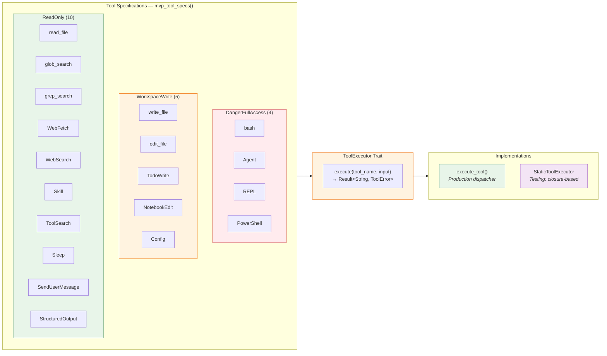
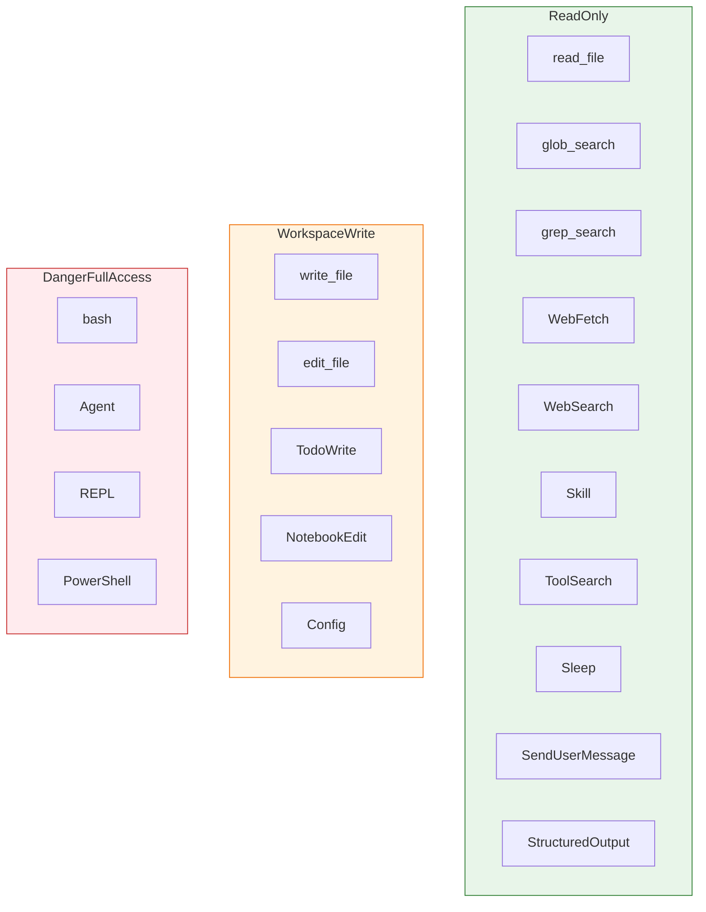

# Tool System

The tool system defines what actions the agent can take in the world. Each tool has a spec (name, description, JSON schema, required permission level), and the `ToolExecutor` trait provides the dispatch mechanism.

## Tool Architecture



## Tool Manifest

Every tool is defined as a `ToolSpec`:

```rust
pub struct ToolSpec {
    pub name: &'static str,
    pub description: &'static str,
    pub input_schema: Value,          // JSON Schema
    pub required_permission: PermissionMode,
}
```

Here's the complete tool table:

| Tool | Permission | Description |
|:--|:--|:--|
| `bash` | DangerFullAccess | Execute a shell command |
| `read_file` | ReadOnly | Read a text file |
| `write_file` | WorkspaceWrite | Write a text file |
| `edit_file` | WorkspaceWrite | Replace text in a file |
| `glob_search` | ReadOnly | Find files by glob pattern |
| `grep_search` | ReadOnly | Search file contents with regex |
| `WebFetch` | ReadOnly | Fetch a URL and process content |
| `WebSearch` | ReadOnly | Search the web for information |
| `TodoWrite` | WorkspaceWrite | Update structured task list |
| `Skill` | ReadOnly | Load a local skill definition |
| `Agent` | DangerFullAccess | Spawn a sub-agent conversation |
| `ToolSearch` | ReadOnly | Search for deferred or specialized tools |
| `NotebookEdit` | WorkspaceWrite | Edit Jupyter notebook cells |
| `Sleep` | ReadOnly | Wait for a specified duration |
| `SendUserMessage` | ReadOnly | Send a message to the user |
| `Config` | WorkspaceWrite | Get or set runtime configuration |
| `StructuredOutput` | ReadOnly | Return structured output |
| `REPL` | DangerFullAccess | Execute code in a REPL |
| `PowerShell` | DangerFullAccess | Execute PowerShell commands |

## Permission Levels Per Tool

The tools are organized into three permission tiers:



## The ToolExecutor Trait

```rust
pub trait ToolExecutor {
    fn execute(&mut self, tool_name: &str, input: &str)
        -> Result<String, ToolError>;
}
```

This is the only interface the agentic loop uses to run tools. The runtime doesn't know *how* tools work — it just calls `execute()` and gets back a string result or an error.

## Production Tool Dispatcher

The production implementation (`tools/src/lib.rs`) uses the `execute_tool()` function to dispatch all built-in tools:

1. **Parse JSON input** for each tool
2. **Dispatch** to the appropriate handler (bash execution, file I/O, web fetch, etc.)
3. **Return** the result as a string

For the **Agent tool**, it spawns an entire sub-conversation:
- Creates a new `ConversationRuntime` with its own session
- Runs an inner agentic loop with the sub-agent's prompt
- Returns the sub-agent's final text response

::: info Agent Sub-Loop
The Agent tool is recursive — it creates a new `ConversationRuntime` inside the tool executor. This means an agent can spawn sub-agents, each with their own conversation history and tool access.
:::

## Tool Registration Pattern

The `StaticToolExecutor` provides a builder-style registration for tests:

```rust
let executor = StaticToolExecutor::new()
    .register("bash", |input| {
        // Parse input, run command
        Ok("output".to_string())
    })
    .register("read_file", |input| {
        Ok("file contents".to_string())
    });
```

The `register` method takes a name and a closure `FnMut(&str) -> Result<String, ToolError>`, stored as a boxed trait object in a `BTreeMap`.

## API Tool Definitions

Tools are also serialized as `ToolDefinition`s for the Anthropic API:

```rust
pub struct ToolDefinition {
    pub name: String,
    pub description: String,
    pub input_schema: Value,
}
```

The `mvp_tool_specs()` function returns all tool specs, which are then converted to API tool definitions when building the message request.
